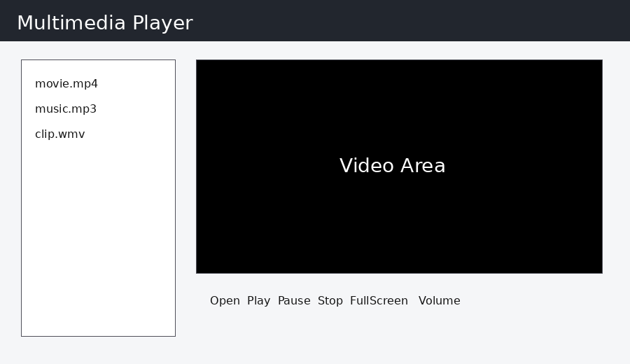

# 多媒體播放器

## 學生資料

- 學號：1123305
- 姓名：范宸瑋
- 課程：視窗程式設計 (II) / Windows Programming (II)
- 開發環境：C# / .NET Framework 4.7.2 / Windows Forms / Visual Studio 2022

## 專案簡介

C# .NET Framework WinForms 多媒體播放器，支援影片/音訊播放清單、播放控制、音量、進度列、循環播放、影片區域縮放與全螢幕播放。

## 執行方式

1. 使用 Visual Studio 2022 開啟 `MultimediaPlayer.sln`。
2. 確認目標框架為 .NET Framework 4.7.2。
3. 按下 `F5` 或點選「開始偵錯」執行。

## GitHub 與繳交注意事項

- 請將實際 GitHub 倉庫網址填入 `1123305_范宸瑋.txt`。
- 已附 `.gitignore`，請勿上傳 `bin/`、`obj/`、`.vs/`、`.git/` 等非必要檔案。
- 建議使用 `SETUP_GIT_COMMANDS.txt` 內的指令設定 commit author。

## 截圖

